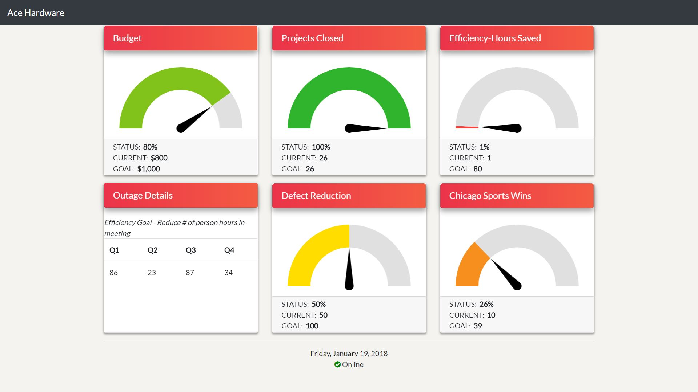

# TV-App 

## Table of Contents
- [About](#about)
- [Tasks](#tasks)
- [Documentation](#documentation)
- [Supported Browsers](#supported-browsers)
- [Changelog](#changelog)
- [Testing](#testing)

## About:
Each card will represent a category that contains information. Front face of each card will have a gauge to visualize what status that category and details in the bottom. Also, each card will "flip" to show more information about that category. The purpose of this project is to attract users attention and show them information.

## Tasks:
~ TO BE ADDED SOON ~

## Documentation:
~ To Be Added Soon ~

## Supported Browsers:
TV-App is compatible with:

- Chrome 35+

(TO BE ADDED SOON)
- Firefox 31+
- IE 10+ 

## Changelog
For changelogs, check out [the Releases section of TVApp](https://github.com/vallchri10/TVApp/releases) or the [CHANGELOG.md](CHANGELOG.md).

## Testing
~ To Be Addded Soon ~ (Jasmine might be a possiblity)
